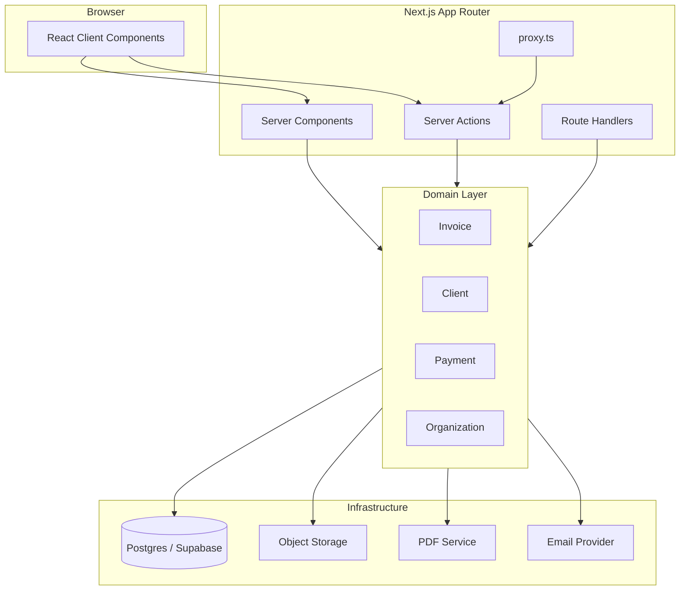
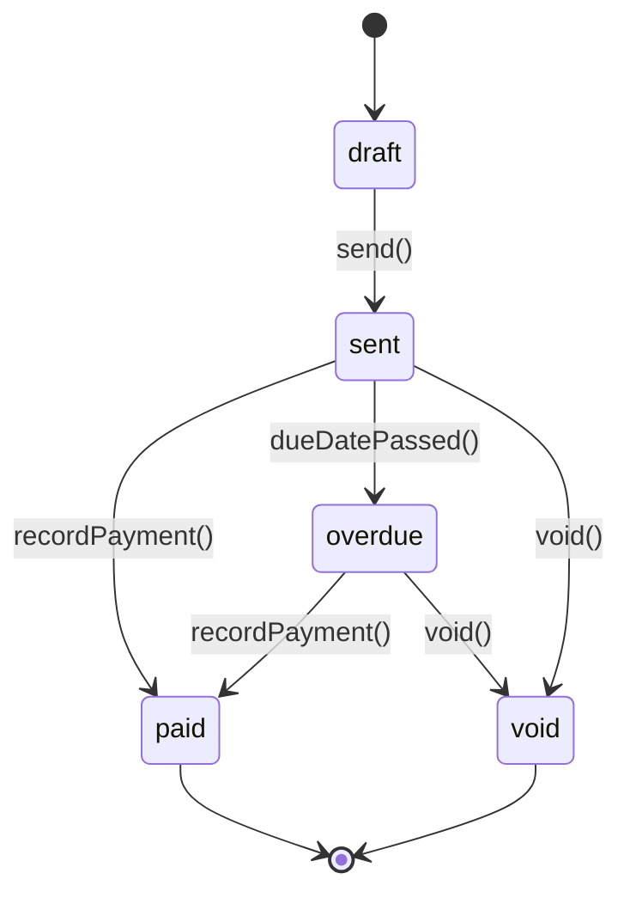

# Invoice Maker — Architecture

Enterprise invoice management app built on Next.js App Router with a layered, domain-driven structure.

## Goals

- Multi-tenant invoicing for freelancers and small businesses
- PDF export, email delivery, payment tracking
- Secure auth, audit trail, and scalable data layer
- Clear separation between UI, application logic, and infrastructure

## Tech Stack

| Layer | Choice | Rationale |
| --- | --- | --- |
| Framework | Next.js 16 (App Router) | RSC, Server Actions, Vercel deployment |
| Language | TypeScript (strict) | Type safety across domain and API |
| UI | shadcn/ui + Tailwind CSS v4 | Accessible components, full ownership |
| Database | Supabase (Postgres) | Auth, RLS, realtime, storage |
| ORM | Drizzle | Lightweight, serverless-friendly, SQL-first |
| Validation | Zod | Shared schemas for forms and server actions |
| PDF | `@react-pdf/renderer` or Puppeteer | Invoice PDF generation |
| Auth | Supabase Auth (or Clerk) | Managed auth with SSR support |

## High-Level Diagram



## Folder Structure

```
src/
├── app/
│   ├── (marketing)/          # Public landing, pricing, legal
│   ├── (auth)/               # Login, register, password reset
│   ├── (dashboard)/          # Protected app shell
│   │   ├── layout.tsx
│   │   ├── dashboard/
│   │   ├── invoices/
│   │   ├── clients/
│   │   └── settings/
│   └── api/                  # Webhooks, PDF download, health
├── actions/                  # Server Actions (mutations)
│   ├── invoices/
│   └── clients/
├── components/
│   ├── ui/                   # shadcn primitives
│   ├── layout/               # Sidebar, header, nav
│   └── invoices/             # Feature-specific UI
├── lib/
│   ├── db/                   # Drizzle client, schema, queries
│   ├── auth/                 # Session helpers
│   ├── validators/           # Zod schemas
│   ├── pdf/                  # PDF templates & render
│   └── utils/                # Shared utilities
├── types/                    # Domain TypeScript types
└── hooks/                    # Client-only React hooks
```

## Domain Model

### Core Entities

- **Organization** — tenant boundary (company profile, tax ID, branding)
- **Client** — customer receiving invoices
- **Invoice** — document with status lifecycle: `draft → sent → paid → overdue → void`
- **LineItem** — quantity, unit price, tax rate per invoice row
- **Payment** — partial or full payment against an invoice

### Invoice Status Flow



## Layer Responsibilities

### Presentation (`app/`, `components/`)

- Server Components for data fetching and layout
- Client Components only when interactivity is required
- No direct database access from client components

### Application (`actions/`)

- Server Actions orchestrate use cases
- Validate input with Zod, call domain services, revalidate paths
- Return typed success/error results

### Domain (`types/`, `lib/validators/`, business rules in `lib/`)

- Pure functions for totals, tax, numbering
- Invariants: invoice number uniqueness per org, non-negative amounts

### Infrastructure (`lib/db/`, `lib/pdf/`, `lib/auth/`)

- Database adapters, external APIs
- Swappable behind narrow interfaces

## Routing Conventions

| Route | Purpose |
| --- | --- |
| `/` | Marketing landing |
| `/login`, `/register` | Auth |
| `/dashboard` | Overview (revenue, overdue) |
| `/invoices` | Invoice list |
| `/invoices/new` | Create invoice |
| `/invoices/[id]` | View / edit invoice |
| `/clients` | Client CRUD |
| `/settings` | Org profile, branding, tax |

Route groups `(marketing)`, `(auth)`, `(dashboard)` do not affect URLs.

## Security

- Row Level Security (RLS) in Supabase scoped by `organization_id`
- Server Actions verify session on every mutation
- `proxy.ts` protects `(dashboard)/*` routes
- Secrets only in server env vars (never `NEXT_PUBLIC_*` for keys)
- CSRF protection via Next.js Server Actions

## Data Access Pattern

```typescript
// Server Component or Server Action
const session = await getSession();
const invoices = await invoiceQueries.listByOrg(session.orgId);
```

All queries filter by organization. Never trust client-supplied org IDs without session check.

## Caching Strategy

- Static marketing pages: default cache
- Dashboard lists: `cache: 'no-store'` or short revalidation
- Mutations: `revalidatePath('/invoices')` after create/update
- Invoice PDFs: generate on demand or cache in object storage

## Environment Variables

See `.env.example`. Required for production:

- `DATABASE_URL`
- Auth provider keys
- Optional: email, storage, PDF service

## Implementation Phases

1. **Foundation** — Next.js, shadcn, folder structure (current)
2. **Auth & org** — Supabase auth, organization onboarding
3. **Clients** — CRUD, search
4. **Invoices** — create, edit, line items, totals
5. **PDF & send** — template, download, email
6. **Payments** — record payments, status automation
7. **Dashboard** — metrics, overdue alerts

## ADRs

Architecture decisions are recorded in `docs/adr/`.
