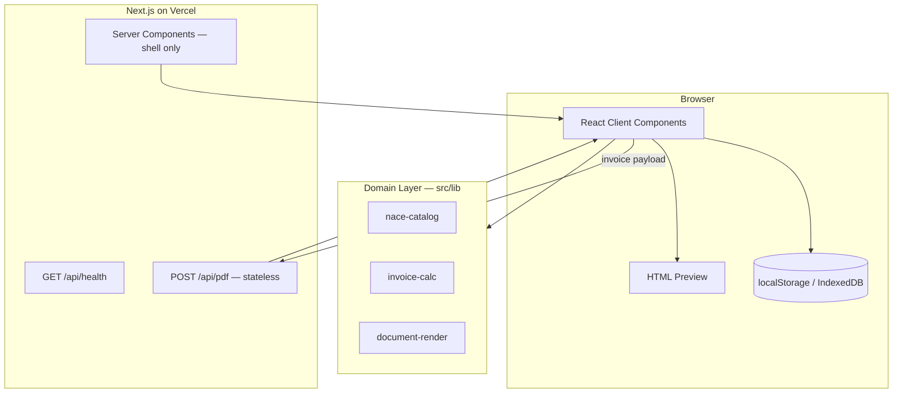

# Invoice Maker — Architecture

Browser-first bilingual invoice generator on Next.js App Router. The authoritative
requirements live in `openspec/specs/`; this document describes how the MVP is
structured at runtime.

## Goals

- Generate bilingual (EN + UA) invoices for a Ukrainian ФОП billing in USD or EUR
- Live HTML preview in the browser; downloadable PDF via a stateless server render
- Supplier and client directories plus invoice register in browser storage only
- No accounts, no server-side data at rest, no payment ledger

## Tech Stack

| Layer | Choice | Rationale |
| --- | --- | --- |
| Framework | Next.js 16 (App Router) | RSC shell, Route Handlers for PDF + health |
| Language | TypeScript (strict) | Type safety across domain and UI |
| UI | shadcn/ui + Tailwind CSS v4 | Accessible components, WEG3D Fin tokens |
| Client storage | localStorage / IndexedDB | Invoice register and directories (browser only) |
| PDF | puppeteer-core + @sparticuz/chromium | Stateless render of `docs/invoice-template.html` |
| Validation | Zod (planned) | Shared schemas for form input |
| Hosting | Vercel | Preview deploys; Fluid Compute for PDF route |

## High-Level Diagram



## Folder Structure

```
src/
├── app/
│   ├── page.tsx                 # Marketing landing
│   ├── (dashboard)/             # App shell (no auth gate in MVP)
│   │   ├── dashboard/
│   │   ├── invoices/
│   │   ├── clients/
│   │   └── settings/            # Supplier profiles
│   └── api/
│       ├── health/route.ts      # Liveness probe
│       └── pdf/route.ts         # Stateless PDF render (planned)
├── components/
│   ├── ui/                      # shadcn primitives
│   ├── layout/                  # Sidebar, shell
│   └── invoices/                # Status badges, form, preview
├── lib/
│   ├── nace/                    # NACE catalog (planned)
│   ├── invoice/                 # Calculations, numbering (planned)
│   ├── render/                  # Template variable fill (planned)
│   └── utils.ts
└── types/                       # Domain TypeScript types
```

Removed from the abandoned enterprise scaffold: `src/lib/db/`, `src/actions/`
(Server Actions for Supabase mutations). See ADR-0002.

## Domain Model

### Core entities (browser-persisted)

- **Supplier profile** — ФОП details and IBANs per currency
- **Client** — billing contact; prefills invoice form
- **Invoice record** — snapshot of printed content + stored status + metadata

### Invoice status

| Stored | Meaning |
| --- | --- |
| `draft` | Being edited |
| `sent` | User marked as delivered |
| `paid` | User marked as settled |
| `cancelled` | User cancelled |

| Display-only | Rule |
| --- | --- |
| `overdue` | `sent` and payment deadline &lt; today (derived, not stored) |

## Layer Responsibilities

### Presentation (`app/`, `components/`)

- Client Components for forms, preview, and browser storage
- Server Components for static shell layout where interactivity is not needed
- No database or Server Actions for mutations in MVP

### Domain (`lib/`, `types/`)

- Pure functions: invoice numbering, amounts, date formatting, NACE lookup, template fill
- Framework-free modules testable without Next.js

### Infrastructure (`app/api/`)

- `GET /api/health` — deployment health
- `POST /api/pdf` — receives invoice JSON, renders template, returns PDF, **stores nothing**

## Security & Privacy

- Supplier tax ID and IBANs live in browser storage or user input — never hardcoded in the client bundle
- PDF route must not log or persist request bodies (see `issues/14-render-function-must-forget.md`)
- No `NEXT_PUBLIC_*` secrets; no database credentials in MVP

## Environment Variables

See `.env.example`. MVP requires only:

- `NEXT_PUBLIC_APP_URL` — canonical app URL for links

PDF route may use platform-provided Chromium on Vercel; no extra env vars required for local dev beyond the app URL.

## Implementation Phases

1. **Spec coherence** — `openspec/specs/`, docs aligned (current)
2. **Domain modules** — NACE catalog, calculations, template render
3. **Form + preview** — structured input, live HTML preview
4. **Browser persistence** — register, supplier/client directories
5. **PDF export** — stateless `/api/pdf` + download/share
6. **Polish** — Ukrainian UI copy, demo seed data, course video path

## ADRs

| ADR | Status |
| --- | --- |
| [0001-initial-stack.md](adr/0001-initial-stack.md) | Superseded by 0002 |
| [0002-browser-first-mvp.md](adr/0002-browser-first-mvp.md) | Accepted |
