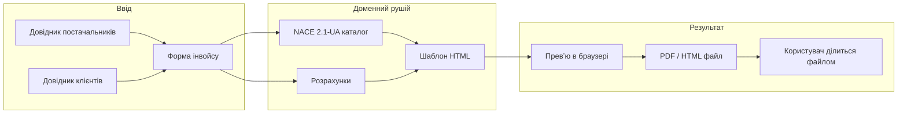
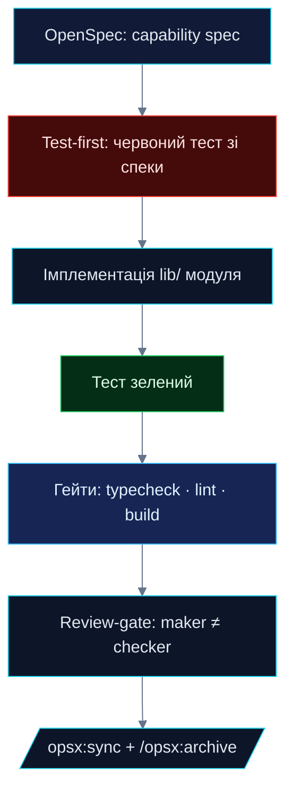
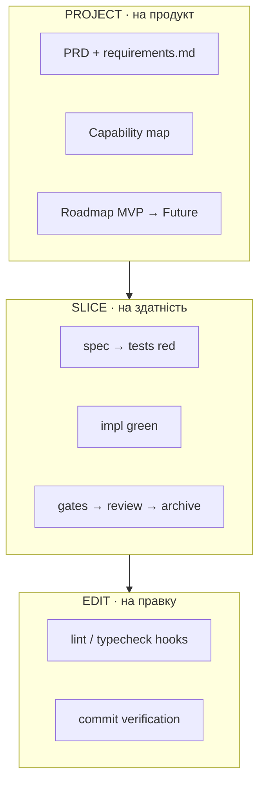
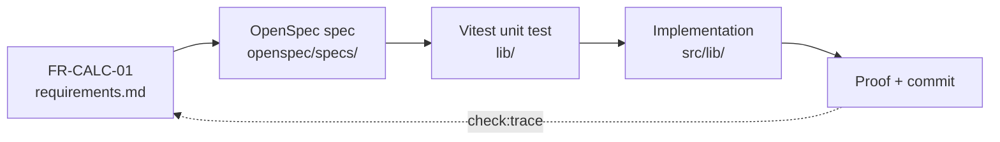
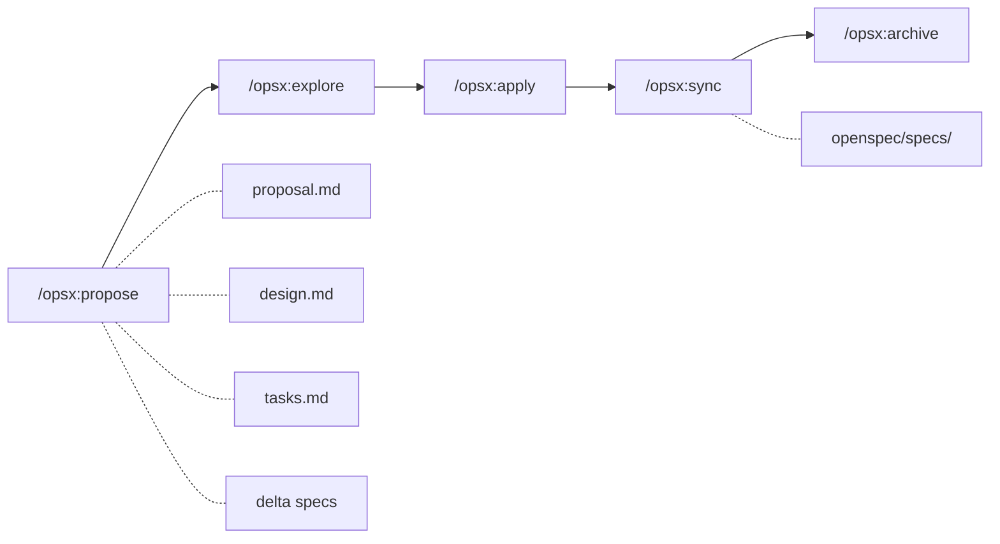
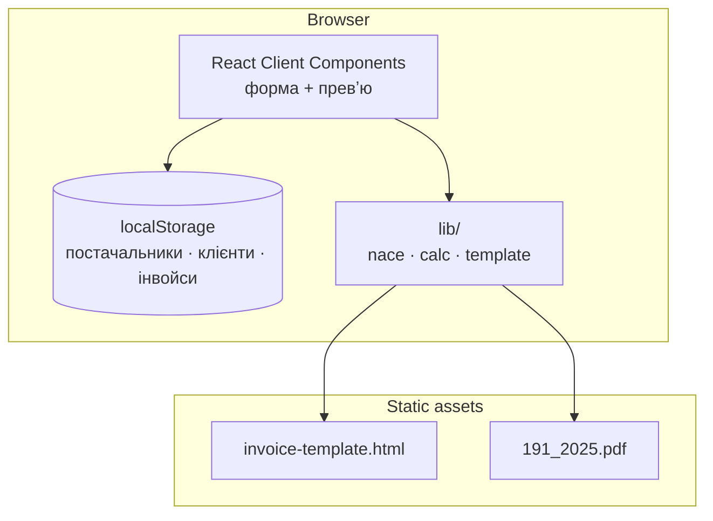
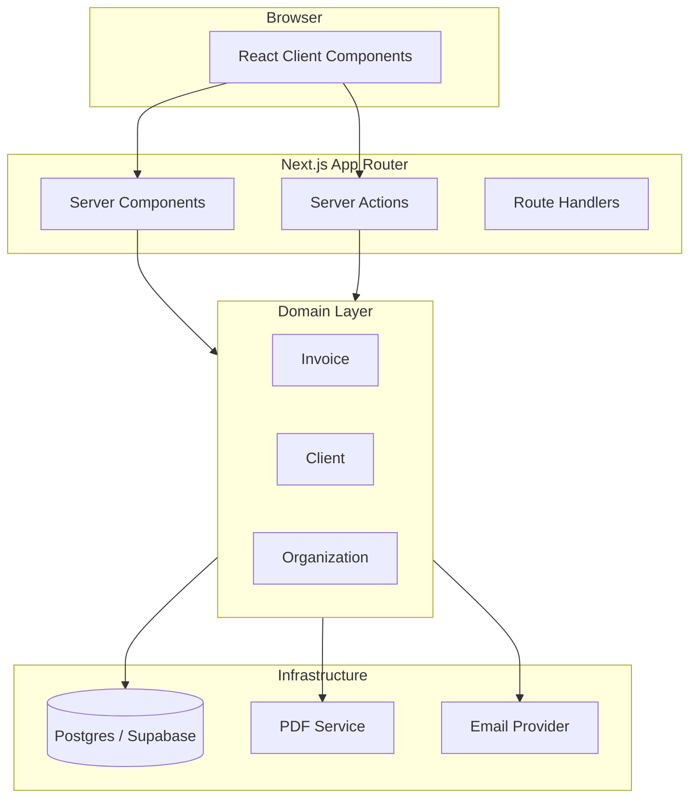
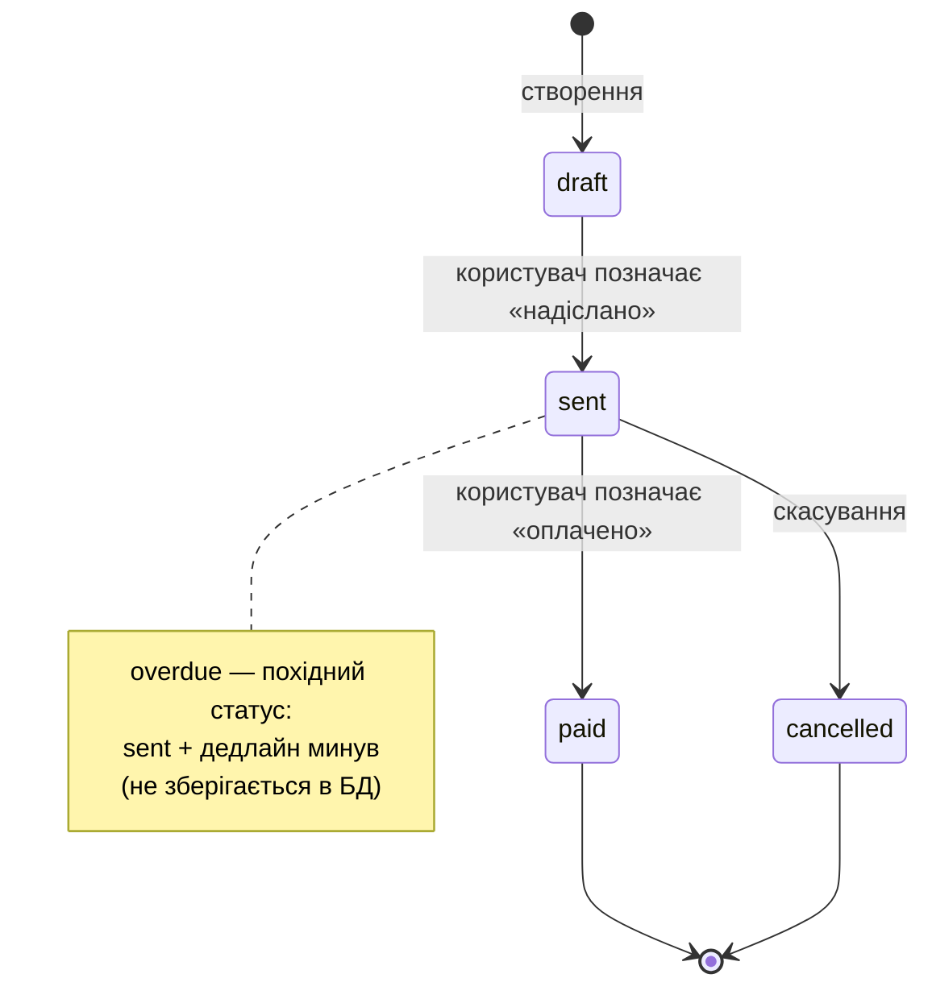
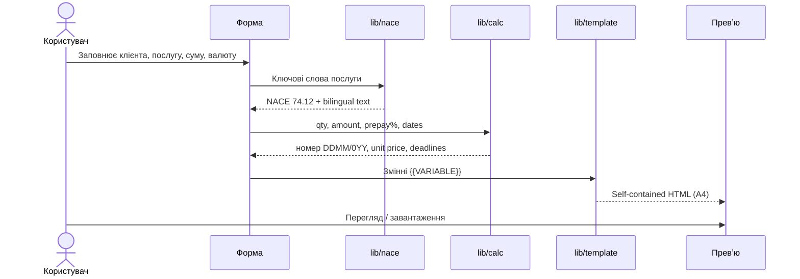
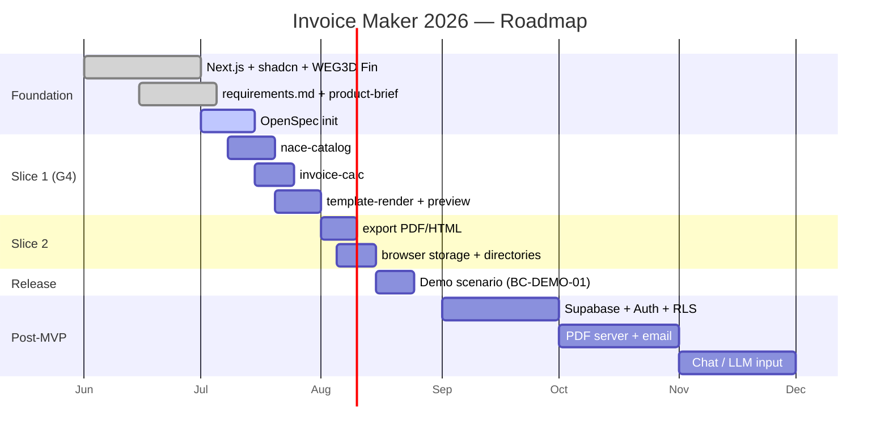

<div align="center">

> Дубль [`README.md`](../README.md) · канонічна версія в корені репозиторію


<br />

**Двомовні інвойси для міжнародних розрахунків · NACE 2.1-UA · USD/EUR**

<br />

[](https://nextjs.org)
[](https://react.dev)
[](https://www.typescriptlang.org)
[](../openspec/config.yaml)
[](../Design.md)

<br />

| | | |
| :---: | :---: | :---: |
| **40+** | **6** | **G4** |
| нумерованих вимог | capabilities | активний gate |
| `FR` · `NFR` · `TC` · `BC` | vertical slices | slice cycle |

<br />

[Документація UA](README-uk.md) · [Вимоги](requirements.md) · [Архітектура](ARCHITECTURE.md) · [Методологія](https://koldovsky.github.io/2026-fwdays-agentic-greenfield-slidev/)

</div>

<br />

> **Generation is solved.** Verification, judgment, and direction are the engineering craft.  
> У цьому репозиторії код — наслідок **специфікацій**, **тестів** і **детермінованих гейтів**, а не навпаки.

**Invoice Maker 2026** — веб-додаток для швидкого створення **двомовних (українська + англійська) інвойсів** для українських ФОПів і фрілансерів, які виставляють рахунки іноземним клієнтам у **USD** або **EUR**.

Розробка ведеться за підходом **Agentic Engineering** і **Spec-Driven Development**: спочатку — перевірювані вимоги та специфікації, потім — вертикальні зрізи з детермінованими гейтами якості. Поточний фокус — перший vertical slice: від структурованого вводу до HTML-превʼю інвойсу.

---

## Зміст

**Огляд**

- [Що це за продукт](#що-це-за-продукт)
- [Для кого](#для-кого)
- [Поточний стан](#поточний-стан)

**Інженерія**

- [Процес розробки](#процес-розробки-agentic-engineering)
- [Архітектура](#архітектура)
- [MVP: перший vertical slice](#mvp-перший-вертикальний-слайс)

**Довідник**

- [Доменна модель](#доменна-модель)
- [Технологічний стек](#технологічний-стек)
- [Інструменти та процеси](#інструменти-та-процеси)
- [Швидкий старт](#швидкий-старт)
- [Верифікація](#верифікація)

<details>
<summary><strong>Розгорнути повний зміст (структура репо, документація, roadmap)</strong></summary>

- [Структура репозиторію](#структура-репозиторію)
- [Документація](#документація)
- [Дорожня карта](#дорожня-карта)

</details>

---

## Що це за продукт

Invoice Maker автоматизує рутину міжнародного виставлення рахунків:

1. Користувач заповнює **форму** (клієнт, послуга, сума, валюта, терміни).
2. Система підбирає **опис послуги за кодом NACE 2.1-UA** (не застарілий KVED).
3. Розраховує номер, дати, ціну за одиницю, передоплату, залишок.
4. Підставляє **банківські реквізити** (USD/EUR IBAN) з профілю постачальника.
5. Генерує **двомовний HTML-документ** з шаблону [`invoice-template.html`](invoice-template.html).
6. Користувач **переглядає, завантажує PDF/HTML** і сам надсилає клієнту (Telegram, WhatsApp, email).



### Ключові принципи продукту

| Принцип | Опис |
| --- | --- |
| **Шаблон — контракт** | Блок TERMS AND CONDITIONS і підпис незмінні (`BC-LEGAL-01`) |
| **NACE, не KVED** | Класифікатор NACE 2.1-UA (наказ Держстату № 191, 2025) |
| **Двомовність документа** | Кожен рядок послуги, дата, термін — EN + UA |
| **Знімок документа** | Виданий інвойс зберігає все, що надруковано; зміна IBAN не переписує старі рахунки |
| **Чесні помилки** | Невалідний ввід → пояснення + приклад правильного формату |
| **Без юридичних порад** | Система генерує документ; відповідальність за комплаєнс — на користувачі |

---

## Для кого

**Основний користувач:** український ФОП / фрілансер у сфері креативних послуг:

- графічний і візуальний дизайн (NACE **74.12**)
- спеціалізований дизайн / 3D-візуалізація (**74.14**)
- постпродакшн відео (**59.12**)

**Типовий сценарій:** виставити рахунок іноземному замовнику в USD або EUR за 2–3 хвилини замість ручного заповнення Word/HTML-шаблону.

---

## Поточний стан

| Область | Статус | Деталі |
| --- | --- | --- |
| **Foundation** | ✅ Готово | Next.js 16, React 19, TypeScript, Tailwind v4, shadcn/ui |
| **Design system** | ✅ Готово | WEG3D Fin ([`../Design.md`](../Design.md), `src/styles/design-tokens.css`) |
| **App shell** | ✅ Готово | Landing, dashboard, навігація (invoices, clients, settings) |
| **Health API** | ✅ Shipped | `GET /api/health` → `{ status: "ok", service: "invoice-maker" }` (`FR-SHELL-03`) |
| **Специфікації** | ✅ Готово | [`requirements.md`](requirements.md), [`product-brief.md`](product-brief.md), [`../CONTEXT.md`](../CONTEXT.md) |
| **OpenSpec** | 🔄 В процесі | [`../openspec/config.yaml`](../openspec/config.yaml), slash-команди `/opsx:*` |
| **NACE каталог** | 📋 Заплановано | Slice 1 — `nace-catalog` + `invoice-calc` + `template-render` |
| **Генерація інвойсу** | 📋 Заплановано | Перший вертикальний слайс (G4) |
| **Chat / LLM ввід** | ⏳ Post-MVP | `FR-CHAT-*` перенесено в Future |
| **Supabase / Auth** | ⏳ Post-MVP | Enterprise-архітектура в `docs/ARCHITECTURE.md` — фаза 2+ |

---

## Процес розробки (Agentic Engineering)

Проєкт використовує **Agentic Engineering** — оркестрацію AI-агентів навколо перевірюваних специфікацій замість нетвореної генерації коду. Методологічні орієнтири: [Agentic Engineering — Greenfield](https://koldovsky.github.io/2026-fwdays-agentic-greenfield-slidev/) (Вʼячеслав Колдовський).

### Product pipeline

<table>
<tr>
<td align="center" width="30%"><sub>01 · INPUT</sub><br /><strong>Форма + довідники</strong><br /><sub>клієнт · послуга · валюта</sub></td>
<td align="center" width="5%">→</td>
<td align="center" width="30%"><sub>02 · ENGINE</sub><br /><strong>NACE + calc + template</strong><br /><sub>детермінований lib/</sub></td>
<td align="center" width="5%">→</td>
<td align="center" width="30%"><sub>03 · OUTPUT</sub><br /><strong>HTML / PDF</strong><br /><sub>bilingual · A4 · share</sub></td>
</tr>
</table>

### Engineering pipeline

<table>
<tr>
<td align="center" width="18%"><sub>SPEC</sub><br /><strong>requirements.md</strong><br /><sub>+ OpenSpec</sub></td>
<td align="center" width="4%">→</td>
<td align="center" width="18%"><sub>RED</sub><br /><strong>test-first</strong><br /><sub>Vitest</sub></td>
<td align="center" width="4%">→</td>
<td align="center" width="18%"><sub>GREEN</sub><br /><strong>lib/ impl</strong><br /><sub>minimal diff</sub></td>
<td align="center" width="4%">→</td>
<td align="center" width="18%"><sub>GATES</sub><br /><strong>typecheck · lint</strong><br /><sub>build</sub></td>
<td align="center" width="4%">→</td>
<td align="center" width="18%"><sub>REVIEW</sub><br /><strong>maker ≠ checker</strong><br /><sub>archive</sub></td>
</tr>
</table>

### Етапи інженерного процесу

| Етап | Зміст | Статус у проєкті |
| --- | --- | --- |
| **Foundation** | Greenfield-репозиторій, Next.js, agent rules | ✅ |
| **Контекст** | Вимоги, дизайн-система, OpenSpec | ✅ |
| **Vertical slice** | spec → test → impl → gates → review | 🎯 поточний |
| **Автоматизація** | Hooks, CI, traceability matrix | заплановано |
| **QA & release** | E2E, UAT, демо-сценарії | заплановано |

### Vertical slice (G4)

Центральний елемент процесу — **Slice Cycle (G4)**: перехід від специфікації до верифікованого «зеленого» стану.



**Правило maker ≠ checker:** той, хто імплементує слайс, **не ревʼюить** власну роботу. Тести пишуться **до** коду, зі специфікації.

### Три вкладені цикли



<details>
<summary><strong>Гейти G0–G8 (детерміновані команди з кодом виходу)</strong></summary>

<br />

| Гейт | Призначення | Наш проєкт |
| --- | --- | --- |
| **G0** | Ініціалізація циклу (loop first) | [`../AGENTS.md`](../AGENTS.md), OpenSpec, git hooks (планується) |
| **G1** | Нумеровані вимоги, scope підписаний | [`requirements.md`](requirements.md) (FR/NFR/TC/BC) |
| **G2** | OpenSpec: capability specs | `openspec/specs/<capability>/spec.md` |
| **G3** | План зміни + людський чекпойнт | `openspec/changes/<name>/` |
| **G4** | **Slice cycle: spec → red → green → gates** | **Перший слайс: nace + calc + template** |
| **G5** | Traceability: FR → spec → test → proof | Матриця в [`requirements.md`](requirements.md) |
| **G6** | QA verify (Playwright, візуальні перевірки) | Планується для release |
| **G7** | Adversarial review | Окремий checker-агент |
| **G8** | UAT triage + регресійні тести | Приймальне тестування |

</details>

<details>
<summary><strong>Ланцюг трасування та OpenSpec workflow</strong></summary>

<br />

### Ланцюг трасування (FR → коміт)



### OpenSpec workflow (Spec-Driven Development)



| Команда | Дія |
| --- | --- |
| `/opsx:propose <change>` | Створити change: proposal, design, tasks, delta specs |
| `/opsx:explore` | Дослідити ідеї без імплементації |
| `/opsx:apply` | Виконати tasks з активного change |
| `/opsx:sync` | Злити delta specs у `openspec/specs/` |
| `/opsx:archive` | Архівувати завершений change |

</details>

---

## Архітектура

### MVP (поточна ціль)

MVP — **детермінований генератор у браузері**: форма + live preview, дані в `localStorage`, експорт PDF/HTML. Без серверної БД, без публічних посилань на інвойси.



<details>
<summary><strong>Enterprise-архітектура (post-MVP)</strong></summary>

<br />

Повна архітектура з multi-tenancy, Supabase, Server Actions — задокументована в [`ARCHITECTURE.md`](ARCHITECTURE.md).



</details>

---

## Доменна модель

Словник домену: [`../CONTEXT.md`](../CONTEXT.md)

| Сутність | Опис |
| --- | --- |
| **Organization** | Tenant-акаунт (post-MVP) |
| **Client** | Замовник, якому виставляється рахунок |
| **Invoice** | Документ з line items, сумами, статусом |
| **LineItem** | Рядок послуги (опис, кількість, ціна, податок) |
| **Payment** | Оплата (post-MVP) |

### Статуси інвойсу (MVP)



---

## MVP: перший вертикальний слайс

Рекомендований **перший vertical slice** ([`requirements.md`](requirements.md)):

> `nace-catalog` + `invoice-calc` + `template-render` → один зелений шлях від структурованого вводу до HTML-превʼю **без чату**.



### Capabilities (зрізи продукту)

| Capability | Requirement IDs | Gate |
| --- | --- | --- |
| `shell` | FR-SHELL-01..03 | G4 (частково ✅) |
| `nace-catalog` | FR-NACE-01..06, BC-NACE-01 | G4 |
| `invoice-calc` | FR-CALC-01..06 | G4 |
| `template-render` | FR-TPL-01..05, BC-LEGAL-01 | G4 |
| `export` | FR-EXPORT-01..03 | G4+ |
| `invoice-chat` | FR-CHAT-*, FR-INPUT-* | Future |

---

## Технологічний стек

### Реалізовано зараз

| Категорія | Технологія | Версія / примітка |
| --- | --- | --- |
| **Framework** | [Next.js](https://nextjs.org) App Router | 16.2.9 |
| **UI** | [React](https://react.dev) | 19.2.4 |
| **Мова** | [TypeScript](https://www.typescriptlang.org) | strict mode |
| **Стилі** | [Tailwind CSS](https://tailwindcss.com) | v4 |
| **Компоненти** | [shadcn/ui](https://ui.shadcn.com) + `@base-ui/react` | v4 |
| **Іконки** | [lucide-react](https://lucide.dev) | tree-shaken imports |
| **Шрифти** | Geist Sans + Geist Mono | `next/font/google` |
| **Design system** | WEG3D Fin | [`../Design.md`](../Design.md) |
| **Compiler** | React Compiler | `babel-plugin-react-compiler` |
| **Lint** | ESLint + eslint-config-next | v9 |
| **Deploy** | [Vercel](https://vercel.com) | preview per PR (планується) |

### Заплановано (MVP / post-MVP)

| Категорія | Технологія | Коли |
| --- | --- | --- |
| **Валідація** | [Zod](https://zod.dev) | MVP — спільні схеми форма + lib |
| **Тести** | [Vitest](https://vitest.dev) | MVP — `lib/` (calc, NACE, template) |
| **E2E / QA** | Playwright | G6 — smoke та візуальні перевірки |
| **ORM** | [Drizzle](https://orm.drizzle.team) | Post-MVP |
| **Backend** | [Supabase](https://supabase.com) (Postgres + Auth) | Post-MVP |
| **PDF** | Browser print / `@react-pdf/renderer` | MVP: browser; post-MVP: server |

---

## Інструменти та процеси

### Agentic IDE та агенти

| Інструмент | Роль у проєкті |
| --- | --- |
| **Cursor** | Основний Agentic IDE; slash-команди `/opsx:*` |
| **Claude Code** | Альтернативний агент; skills у `.claude/` |
| **AGENTS.md** | Конституція проєкту: Next.js rules, design system, OpenSpec |
| **Agent Skills** | `openspec-*`, `vercel-react-best-practices` |
| **OpenSpec CLI** | `@fission-ai/openspec` — spec-driven workflow |

### Процеси якості

| Процес | Опис |
| --- | --- |
| **Spec-Driven Development (SDD)** | Специфікація → план → імплементація → верифікація |
| **OpenSpec** | Living specs у `openspec/specs/`, зміни через `openspec/changes/` |
| **Test-first (G4)** | Червоний тест зі спеки → імплементація → зелений |
| **Maker ≠ Checker** | Імплементер не ревʼюить власний слайс |
| **Нумеровані вимоги** | Стабільні ID: `FR-*`, `NFR-*`, `TC-*`, `BC-*` |
| **Traceability matrix** | FR → spec → test → proof → commit |
| **Verification gates** | `npm run typecheck && npm run lint && npm run build` |
| **ADR** | Architecture Decision Records у `docs/adr/` |

### Навички (skills), які застосовуємо

- **Domain modeling** — сутності Invoice, Client, NACE catalog
- **Frontend patterns** — RSC, Client Components лише для інтерактивності
- **React best practices** — Vercel engineering guide (`.agents/skills/`)
- **Security review** — IBAN/ПДВ не в client bundle (`NFR-SEC-01`)
- **TDD workflow** — test-first для `lib/` модулів

---

<details>
<summary><strong>Структура репозиторію</strong></summary>

<br />

```
.
├── src/
│   ├── app/                    # Next.js App Router
│   │   ├── (dashboard)/        # Dashboard, invoices, clients, settings
│   │   ├── api/health/         # Health check (shipped)
│   │   └── page.tsx            # Landing
│   ├── components/
│   │   ├── ui/                 # shadcn primitives
│   │   ├── layout/             # Sidebar, shell
│   │   └── invoices/           # InvoiceStatusBadge, domain UI
│   ├── lib/                    # Domain logic (calc, nace, template — planned)
│   ├── actions/                # Server Actions scaffold (post-MVP)
│   ├── types/                  # Invoice, Client, LineItem
│   └── styles/design-tokens.css
├── docs/
│   ├── assets/                 # README banner, handoff assets
│   ├── requirements.md         # Source of truth — нумеровані вимоги
│   ├── product-brief.md        # Бізнес-наратив
│   ├── ARCHITECTURE.md         # Enterprise-архітектура (фаза 2+)
│   ├── research.md             # Оригінальні нотатки (UA)
│   ├── invoice-template.html   # HTML-шаблон інвойсу
│   └── adr/                    # Architecture Decision Records
├── openspec/
│   ├── config.yaml             # OpenSpec + project context
│   ├── specs/                  # Living capability specs
│   └── changes/                # In-flight changes
├── Design.md                   # WEG3D Fin design system
├── CONTEXT.md                  # Domain glossary
└── AGENTS.md                   # Agent rules (Cursor / Claude Code)
```

</details>

---

## Документація

| Документ | Призначення |
| --- | --- |
| [`requirements.md`](requirements.md) | **Єдине джерело правди** — FR/NFR/TC/BC з ID |
| [`product-brief.md`](product-brief.md) | Бізнес-контекст, MVP vs Future |
| [`ARCHITECTURE.md`](ARCHITECTURE.md) | Шарова архітектура, фази імплементації |
| [`research.md`](research.md) | User research, формати вводу, тригери |
| [`invoice-template.html`](invoice-template.html) | Контракт верстки інвойсу |
| [`191_2025.pdf`](191_2025.pdf) | NACE 2.1-UA (наказ Держстату № 191) |
| [`../Design.md`](../Design.md) | WEG3D Fin — токени, типографіка, компоненти |
| [`../CONTEXT.md`](../CONTEXT.md) | Глосарій домену |
| [`../openspec/config.yaml`](../openspec/config.yaml) | Контекст для OpenSpec-агентів |
| [`README-uk.md`](README-uk.md) | Цей документ (дубль кореневого README) |

---

## Швидкий старт

### Вимоги

- Node.js 20+
- npm 10+

### Встановлення

```bash
git clone <repo-url>
cd "INVOICE MAKER 2026"
npm install
cp .env.example .env.local   # опційно для post-MVP
```

### Розробка

```bash
npm run dev
```

Відкрийте [http://localhost:3000](http://localhost:3000).

| Маршрут | Опис |
| --- | --- |
| `/` | Landing page |
| `/dashboard` | Dashboard shell |
| `/invoices` | Список інвойсів |
| `/invoices/new` | Створення інвойсу |
| `/clients` | Клієнти |
| `/settings` | Налаштування |
| `/api/health` | Health check |

---

## Верифікація

Перед кожним merge / gate G4:

```bash
npm run typecheck   # tsc --noEmit
npm run lint        # eslint
npm run build       # typecheck + next build
```

Цільові NFR:

- `NFR-PERF-01` — build < 60 s
- `NFR-DX-01` — typecheck + lint + build проходять на main

---

## Дорожня карта

<details>
<summary><strong>Розгорнути Gantt roadmap та out-of-scope</strong></summary>

<br />



### Out of scope (MVP)

- Chat / LLM-ввід (`FR-CHAT-*`)
- Multi-tenant auth, Supabase, Drizzle
- Серверний PDF, email delivery
- Payment tracking, автоматичний lifecycle
- Повний каталог NACE (651 клас) — лише креативні послуги
- E-invoicing / інтеграція з податковою

</details>

---

## Ліцензія

All rights reserved.
